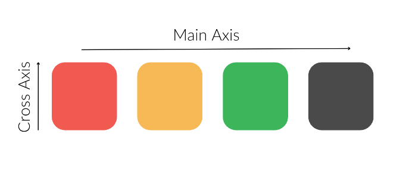

# Flexbox

## Main axis and cross axis

## Flex container properties

- flex-flow : flex-direction and flex-wrap property in one line

- justify-content : align items on the main axis
- align-items : align items on the cross axis
- align-content : flex container with wrap property, align the lines to distribute the space on the cross axis

### flex-flow

`flex-flow : row wrap;`

### justify-content

`justify-content: flex-start | flex-end | center | space-between | space-around | space-evenly;`

### align-items

`align-items: stretch | flex-start | flex-end | center | baseline;`

### align-content

`align-content: stretch | flex-start | flex-end | center | space-between | space-around;`

## Flex item properties

- order : order of the item
- flex : flex-grow, flex-shrink and flex-basis property in one line
- align-self : align the item on the cross axis

### order

`order: <integer>;`

### flex

`flex: <number> | <length> | <percentage>;`

### align-self

`align-self: auto | flex-start | flex-end | center | baseline | stretch;`
